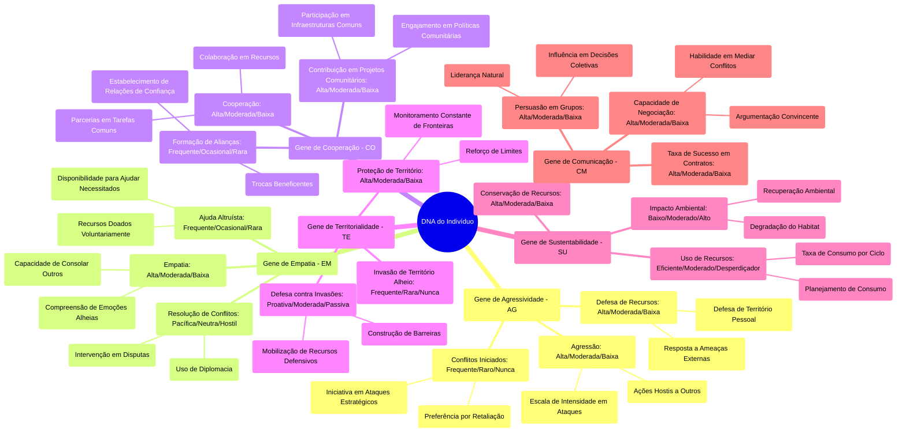

# poc-genetic-algorithms-civilization-in-minecraft

Para criar uma prova de conceito (POC) utilizando *Genetic Algorithms* (Algoritmos Genéticos) em uma sociedade no Minecraft, onde os indivíduos evoluem e formam uma raça consciente e autônoma, você pode seguir este plano de implementação. A sociedade será programada com regras sociais simples, como respeito à propriedade privada, não iniciar violência contra pessoas pacíficas e a liberdade de firmar contratos voluntários.

### 1. **Objetivo da POC**:
Criar uma simulação onde os indivíduos controlados por inteligência artificial (AI) no Minecraft evoluem utilizando Algoritmos Genéticos. Através dessa evolução, eles desenvolverão características (ou "genes") que os permitirão formar uma sociedade autônoma baseada em princípios libertários, como as regras sociais que você mencionou.

### 2. **Estrutura do Algoritmo Genético**:
O Algoritmo Genético será responsável por evoluir as ações dos indivíduos com base em suas interações no ambiente do jogo. As interações podem ser moldadas por três regras básicas de comportamento social:

- **Respeito à Propriedade Privada**: Eles devem aprender a identificar e respeitar os limites do território de outros indivíduos.
- **Não iniciar violência contra pessoas pacíficas**: Eles precisam aprender a distinguir entre ações pacíficas e agressivas e agir de maneira pacífica quando interagirem com indivíduos pacíficos.
- **Liberdade de firmar contratos voluntários**: A interação entre os indivíduos deve permitir acordos, como trocas, sem coerção.

### 3. **Representação dos Genes**:
Cada indivíduo será representado por um conjunto de genes que determinam seu comportamento social. Alguns exemplos de genes podem incluir:

- **Gene de agressividade**: Controla a propensão do indivíduo a iniciar violência.
- **Gene de respeito à propriedade**: Determina a tendência do indivíduo a reconhecer e respeitar o espaço de outros.
- **Gene de cooperatividade**: Regula a capacidade do indivíduo de formar contratos ou colaborar com outros.
- **Gene de empatia**: Influencia a resposta do indivíduo a interações pacíficas.

Cada gene terá um valor entre 0 e 1, representando a intensidade ou o grau da característica. Por exemplo:

- `Gene de agressividade`: 0.1 (pouca agressividade) a 1.0 (muito agressivo).
- `Gene de respeito à propriedade`: 0 (desrespeita propriedade) a 1.0 (respeita totalmente).
- `Gene de cooperatividade`: 0 (não coopera) a 1.0 (coopera ativamente).

### 4. **Ambiente e Interações**:
O ambiente do Minecraft fornecerá um espaço dinâmico onde os indivíduos interagem entre si. Cada indivíduo tem sua própria *propriedade* (um espaço delimitado que ele protege) e pode interagir com outros indivíduos. 

- **Propriedade Privada**: Cada indivíduo delimita um espaço (usando blocos de Minecraft) e protegerá esse espaço. O gene de respeito à propriedade determinará como ele reage quando alguém entra em sua propriedade.
- **Interações Pacíficas vs. Violentas**: A interação pacífica ocorre quando indivíduos com uma alta pontuação em cooperatividade e empatia interagem. A violência ocorre quando indivíduos com alta agressividade atacam outros.
- **Contratos Voluntários**: Indivíduos com alta cooperatividade podem formar alianças ou realizar transações com outros. O contrato será uma troca de recursos ou ajuda, e o gene de cooperatividade influencia a frequência e a aceitação desses acordos.

### 5. **Processo de Evolução**:
A evolução dos indivíduos ocorre através de uma simulação de seleção natural, utilizando Algoritmos Genéticos. O processo básico seria o seguinte:

#### Passo 1: Inicialização
- Um número inicial de indivíduos é gerado com uma diversidade de genes aleatórios.
- Cada indivíduo tem uma representação genética que define seu comportamento.

#### Passo 2: Simulação
- Os indivíduos são colocados no ambiente Minecraft e começam a interagir com outros.
- Durante cada ciclo, os indivíduos avaliam suas interações com base nas três regras sociais:
  - Se eles respeitam a propriedade, suas interações com outros indivíduos são positivas.
  - Se eles agem violentamente, eles podem sofrer punições (perder recursos ou ganhar uma reputação negativa).
  - Se formam contratos voluntários, ganham benefícios e confiança.
  
#### Passo 3: Seleção Natural
- Após um número determinado de ciclos (gerações), os indivíduos com melhor desempenho nas interações são selecionados para "reproduzir" (criar descendentes).
- A reprodução envolve a combinação (crossover) dos genes de dois indivíduos selecionados e uma mutação aleatória nos genes.
- A combinação pode ser feita de maneira simples: pegando metade dos genes de um progenitor e a outra metade do outro.

#### Passo 4: Mutação
- Em cada nova geração, uma pequena chance de mutação ocorre em cada gene, criando uma leve variação. Isso ajuda na evolução ao criar novas soluções para os problemas sociais.

#### Passo 5: Repetição
- O ciclo é repetido várias vezes, com os indivíduos evoluindo gradualmente para se tornarem mais eficientes nas interações sociais, respeitando as regras do jogo e formando uma sociedade mais harmoniosa.

### 6. **Métricas de Sucesso**:
O desempenho dos indivíduos será avaliado com base nas seguintes métricas:
- **Nível de violência**: Quantidade de interações violentas, que deve ser minimizada.
- **Respeito à propriedade**: Percentual de vezes que a propriedade de um indivíduo é respeitada corretamente.
- **Taxa de contratos voluntários**: Quantidade de contratos ou trocas realizadas sem coerção.
- **Sustentabilidade**: A capacidade de a sociedade manter-se funcionando a longo prazo sem colapsar devido à violência ou conflitos.

### 7. **Tecnologias e Ferramentas para Implementação**:
- **Minecraft modding**: Utilize o Minecraft Forge ou Fabric para criar modificações no jogo e programar o comportamento dos NPCs com IA.
- **Linguagens de programação**: Java ou Python (usando bibliotecas como `PyCraft` para interagir com o Minecraft).
- **Algoritmos Genéticos**: Bibliotecas de Algoritmos Genéticos em Python como `DEAP` ou escreva seu próprio algoritmo para implementar a evolução dos genes.

### 8. **Possíveis Expansões**:
- Introduzir mais complexidade nas interações sociais, como liderança política, ideologias, e diferentes formas de governo.
- Adicionar mais variáveis aos genes (como inteligência, habilidades de negociação, etc.).
- Estender a simulação para incluir conflitos, guerras, ou colaboração entre diferentes facções ou sociedades no jogo.

---

**Genoma da Civilização**

Esta documentação descreve os elementos fundamentais que compõem o genoma da civilização simulada, especificando os atributos e comportamentos que definem suas características sociais, econômicas e culturais.

---

### 1. **Cultura e Valores**
- **Descrição:** Define as crenças, ética e prioridades culturais.
- **Atributos:**
  - Pacifismo: **50%**
  - Pragmatismo: **30%**
  - Idealismo: **20%**

---

### 2. **Estrutura Social**
- **Descrição:** Modelo de organização social.
- **Classes:**
  - Líderes: **10%**
  - Trabalhadores: **60%**
  - Guerreiros: **20%**
  - Artistas: **10%**
- **Cooperação vs. Individualismo:**
  - Cooperação: **70%**
  - Individualismo: **30%**

---

### 3. **Recursos e Economia**
- **Descrição:** Forma como os recursos são coletados, distribuídos e utilizados.
- **Foco:**
  - Agricultura: **50%**
  - Mineração: **30%**
  - Artesanato: **20%**
- **Gestão de Recursos:** Sustentável

---

### 4. **Tecnologia e Inovação**
- **Descrição:** Ritmo de avanço tecnológico e áreas de interesse.
- **Prioridade Tecnológica:**
  - Defesa: **40%**
  - Infraestrutura: **30%**
  - Transporte: **30%**
- **Velocidade de Inovação:** Moderada

---

### 5. **Genoma Genético**
- **Parâmetros Biológicos e Comportamentais:**
  - Taxa de Crescimento Populacional: **2% ao ano**
  - Preferência de Biomas: **Planícies e Florestas**
  - Adaptação Climática: **Alta**

---

### 6. **Política e Governança**
- **Modelo Político:** Democracia participativa
- **Expansão Territorial:**
  - Padrão: **Moderado**
  - Foco: **Comércio e diplomacia**

---

### 7. **Religião e Crenças**
- **Descrição:** Sistema de crenças predominante.
- **Sistema Religioso:** Politeísta
- **Influência na Sociedade:** Moderada

---

### 8. **Defesa e Estratégia**
- **Descrição:** Políticas e práticas de segurança.
- **Estratégia de Defesa:**
  - Fortificações: **60%**
  - Diplomacia: **40%**

---

### 9. **Relações Externas**
- **Descrição:** Postura em relação a outras civilizações.
- **Política Externa:**
  - Amigável: **70%**
  - Neutra: **20%**
  - Hostil: **10%**

---

### 10. **Inovação Cultural**
- **Descrição:** Abordagem para mudanças culturais.
- **Tendência:** Progressista

---

### 11. **Educação e Conhecimento**
- **Descrição:** Importância atribuída à educação.
- **Prioridade Educacional:** Alta
- **Foco:**
  - Ciências: **40%**
  - Artes: **30%**
  - Habilidades Práticas: **30%**

---

## Punições

A civilização simulada adota um sistema de punições não violentas, baseadas em mecanismos sociais e econômicos, que incentivem comportamentos positivos sem recorrer à violência. 

---

### 1. **Redução de Recompensas ou Benefícios**
- **Descrição:** Indivíduos que violarem as regras sociais (como desrespeitar a propriedade ou iniciar violência) terão suas recompensas reduzidas ou benefícios temporariamente suspensos.
- **Exemplo:** 
  - Menor chance de acesso a recursos valiosos.
  - Restrições temporárias em zonas ricas em recursos.

---

### 2. **Isolamento Temporário**
- **Descrição:** Indivíduos com comportamento disruptivo são temporariamente excluídos de interações sociais.
- **Exemplo:** 
  - O indivíduo é "banido" de áreas comuns ou de comércio por um período específico.
  - Perda de acesso a contratos ou trocas voluntárias.

---

### 3. **Redução na Reputação**
- **Descrição:** Um sistema de reputação pública mede a confiabilidade e cooperação dos indivíduos. Violações às regras reduzem a reputação, dificultando interações futuras.
- **Exemplo:**
  - Outros indivíduos evitam interagir com indivíduos de baixa reputação.
  - Contratos tornam-se mais caros ou indisponíveis para eles.

---

### 4. **Serviço Comunitário**
- **Descrição:** Indivíduos que violarem regras são obrigados a realizar ações que beneficiem a sociedade.
- **Exemplo:**
  - Recolher recursos para a comunidade.
  - Construir ou reparar infraestruturas, como muros ou fazendas.

---

### 5. **Taxas ou Multas**
- **Descrição:** Recursos do infrator são retirados como forma de compensação às vítimas ou à comunidade.
- **Exemplo:**
  - Perda de uma parte dos recursos coletados.
  - Necessidade de "pagar" para compensar danos causados.

---

### 6. **Missões de Reabilitação**
- **Descrição:** Indivíduos infratores recebem missões específicas que devem ser concluídas para "recuperar" sua posição na sociedade.
- **Exemplo:**
  - Realizar tarefas de cooperação, como ajudar outros indivíduos.
  - Demonstrar pacifismo em interações futuras por um certo número de ciclos.

---

### 7. **Redistribuição de Recursos**
- **Descrição:** Recursos adquiridos pelo infrator são redistribuídos para aqueles que sofreram com a infração.
- **Exemplo:**
  - Se um indivíduo roubar de outro, os recursos roubados (ou equivalente) são devolvidos ou redistribuídos.

---

### 8. **Penalidades de Evolução**
- **Descrição:** Indivíduos com comportamento negativo enfrentam restrições na passagem de seus genes para a próxima geração.
- **Exemplo:**
  - Redução da probabilidade de transmissão dos genes problemáticos.
  - Maior chance de mutações que incentivem comportamentos positivos.

---

Essas punições promovem a autorregulação da sociedade simulada, incentivam a cooperação e minimizam conflitos, mantendo a harmonia e evolução sustentável da civilização.

---
## Objetivo da Civilização

1 - Crescer e se multiplicar
2 - Ter uma vida sustentavel


---

## Estrutura paleogenômica


## DNA

```mermaid
graph TD
    A[DNA do Indivíduo] --> B[Gene de Agressividade AG]
    A --> C[Gene de Empatia EM]
    A --> D[Gene de Cooperação CO]
    A --> E[Gene de Territorialidade TE]
    A --> F[Gene de Sustentabilidade SU]
    A --> G[Gene de Comunicação CM]

    %% Gene de Agressividade
    B --> B1[Agressão: Alta/Moderada/Baixa]
    B --> B2[Defesa de Recursos: Alta/Moderada/Baixa]
    B --> B3[Conflitos Iniciados: Frequente/Raro/Nunca]
    B1 --> B1a[Ações Hostis a Outros]
    B1 --> B1b[Escala de Intensidade em Ataques]
    B2 --> B2a[Defesa de Território Pessoal]
    B2 --> B2b[Resposta a Ameaças Externas]
    B3 --> B3a[Iniciativa em Ataques Estratégicos]
    B3 --> B3b[Preferência por Retaliação]

    %% Gene de Empatia
    C --> C1[Empatia: Alta/Moderada/Baixa]
    C --> C2[Ajuda Altruísta: Frequente/Ocasional/Rara]
    C --> C3[Resolução de Conflitos: Pacífica/Neutra/Hostil]
    C1 --> C1a[Compreensão de Emoções Alheias]
    C1 --> C1b[Capacidade de Consolar Outros]
    C2 --> C2a[Disponibilidade para Ajudar Necessitados]
    C2 --> C2b[Recursos Doados Voluntariamente]
    C3 --> C3a[Uso de Diplomacia]
    C3 --> C3b[Intervenção em Disputas]

    %% Gene de Cooperação
    D --> D1[Cooperação: Alta/Moderada/Baixa]
    D --> D2[Formação de Alianças: Frequente/Ocasional/Rara]
    D --> D3[Contribuição em Projetos Comunitários: Alta/Moderada/Baixa]
    D1 --> D1a[Parcerias em Tarefas Comuns]
    D1 --> D1b[Colaboração em Recursos]
    D2 --> D2a[Estabelecimento de Relações de Confiança]
    D2 --> D2b[Trocas Beneficentes]
    D3 --> D3a[Participação em Infraestruturas Comuns]
    D3 --> D3b[Engajamento em Políticas Comunitárias]

    %% Gene de Territorialidade
    E --> E1[Proteção de Território: Alta/Moderada/Baixa]
    E --> E2[Invasão de Território Alheio: Frequente/Rara/Nunca]
    E --> E3[Defesa contra Invasões: Proativa/Moderada/Passiva]
    E1 --> E1a[Monitoramento Constante de Fronteiras]
    E1 --> E1b[Reforço de Limites]
    E3 --> E3a[Construção de Barreiras]
    E3 --> E3b[Mobilização de Recursos Defensivos]

    %% Gene de Sustentabilidade
    F --> F1[Uso de Recursos: Eficiente/Moderado/Desperdiçador]
    F --> F2[Conservação de Recursos: Alta/Moderada/Baixa]
    F --> F3[Impacto Ambiental: Baixo/Moderado/Alto]
    F1 --> F1a[Taxa de Consumo por Ciclo]
    F1 --> F1b[Planejamento de Consumo]
    F3 --> F3a[Degradação do Habitat]
    F3 --> F3b[Recuperação Ambiental]

    %% Gene de Comunicação
    G --> G1[Capacidade de Negociação: Alta/Moderada/Baixa]
    G --> G2[Taxa de Sucesso em Contratos: Alta/Moderada/Baixa]
    G --> G3[Persuasão em Grupos: Alta/Moderada/Baixa]
    G1 --> G1a[Habilidade em Mediar Conflitos]
    G1 --> G1b[Argumentação Convincente]
    G3 --> G3a[Influência em Decisões Coletivas]
    G3 --> G3b[Liderança Natural]

    %% Estilo dos elementos principais
    style A fill:#f9f,stroke:#333,stroke-width:2px
    style B,C,D,E,F,G fill:#bbf,stroke:#333,stroke-width:1px

    %% Estilo dos subatributos
    style B1,B2,B3,C1,C2,C3,D1,D2,D3,E1,E2,E3,F1,F2,F3,G1,G2,G3 fill:#bfb,stroke:#333,stroke-width:1px
    style B1a,B1b,B2a,B2b,B3a,B3b,C1a,C1b,C2a,C2b,C3a,C3b,D1a,D1b,D2a,D2b,D3a,D3b,E1a,E1b,E3a,E3b,F1a,F1b,F3a,F3b,G1a,G1b,G3a,G3b fill:#dfd,stroke:#333,stroke-width:1px
```




> Mindmap



## Gene

### Pontos Principais para a Criação de um Gene no Contexto do Minecraft

A criação de um gene envolve alguns passos fundamentais, desde sua definição inicial até sua integração no ambiente de simulação. Vamos estruturar de maneira didática:

---

### **1. Estrutura Básica de um Gene**

**O que é um gene?**  
No contexto, um gene é um valor ou conjunto de valores que define uma característica ou comportamento específico de um indivíduo no ambiente.

#### **Estrutura Genética**
- **Identificador do Gene:** Nome único que representa o comportamento (ex.: "Gene de Agressividade").
- **Tipo de Valor:** Numérico (0 a 1), categórico (ex.: "Alto", "Médio", "Baixo") ou binário (0 ou 1).
- **Impacto no Comportamento:** Define como ele afeta as decisões ou ações dos indivíduos.
  
#### **Exemplo de Gene:**
```json
{
  "nome": "Gene de Cooperação",
  "tipo": "numérico",
  "valor_inicial": 0.7,
  "impacto": "Determina a probabilidade de formar alianças e realizar trocas de recursos."
}
```

---

### **2. Integração do Gene no Indivíduo**

Cada indivíduo possui um conjunto de genes que, juntos, definem seu comportamento.  

#### **Estrutura de Um Indivíduo**
```json
{
  "id": 1,
  "genes": {
    "AG": 0.4,  // Gene de Agressividade
    "EM": 0.6,  // Gene de Empatia
    "CO": 0.8,  // Gene de Cooperação
    "TE": 0.5,  // Gene de Territorialidade
    "SU": 0.7,  // Gene de Sustentabilidade
    "CM": 0.9   // Gene de Comunicação
  }
}
```

- **Genótipo:** O conjunto de valores genéticos do indivíduo.  
- **Fenótipo:** Como esses valores afetam o comportamento no ambiente (ex.: "Mais cooperativo" ou "Menos territorial").

---

### **3. Processo de Evolução**

O processo de evolução utiliza Algoritmos Genéticos, que simulam a seleção natural para melhorar os genes das gerações futuras.

#### **Etapas do Processo de Evolução**
1. **Inicialização:**
   - Crie uma população inicial com indivíduos que possuem genes aleatórios.
   - Exemplo: 100 indivíduos com valores genéticos gerados aleatoriamente entre 0 e 1.

2. **Interação:**
   - Os indivíduos interagem no ambiente do Minecraft (coletam recursos, defendem territórios, negociam).
   - Suas ações resultam em pontuações (fitness) com base no desempenho.

3. **Avaliação (Fitness):**
   - O desempenho de cada indivíduo é avaliado por métricas como:
     - Recursos acumulados.
     - Respeito às regras sociais.
     - Quantidade de contratos voluntários.

4. **Seleção Natural:**
   - Indivíduos com maior fitness são escolhidos para reprodução.
   - Exemplo: Top 20% da população é selecionada.

5. **Crossover (Recombinação):**
   - Combina os genes de dois indivíduos selecionados para criar novos descendentes.
   - Exemplo:  
     ```json
     Pai 1: {"AG": 0.5, "EM": 0.7}
     Pai 2: {"AG": 0.3, "EM": 0.6}
     Filho: {"AG": 0.4, "EM": 0.65}  // Média dos pais
     ```

6. **Mutação:**
   - Pequena alteração aleatória nos genes dos descendentes para introduzir variação genética.
   - Exemplo:  
     Antes: `{"CO": 0.8}`  
     Após mutação: `{"CO": 0.85}`  

7. **Nova Geração:**
   - A nova geração substitui a antiga, repetindo o ciclo.

---

### **4. Processo de Mutação**

A mutação é essencial para introduzir diversidade e evitar estagnação evolutiva.

#### **Como Funciona a Mutação**
- **Probabilidade de Mutação:** Normalmente entre 1% e 5% por gene por geração.
- **Tipos de Mutação:**
  1. **Mutação em Genes Numéricos:**
     - Aplica uma pequena alteração ao valor atual.
     - Exemplo: `0.6 → 0.63` (adiciona +0.03 aleatoriamente).
  2. **Mutação em Genes Categóricos:**
     - Troca aleatória dentro do conjunto de categorias.
     - Exemplo: "Moderado" → "Alto".
  3. **Mutação em Genes Binários:**
     - Inverte o valor.
     - Exemplo: `0 → 1`.

#### **Exemplo de Código para Mutação (Pseudo-Código):**
```python
import random

def mutate_gene(gene_value, mutation_rate=0.05):
    if random.random() < mutation_rate:  # Decide se haverá mutação
        mutation = random.uniform(-0.1, 0.1)  # Pequena variação
        new_value = max(0, min(1, gene_value + mutation))  # Garante que fique entre 0 e 1
        return new_value
    return gene_value
```

---

### **5. Visualização do Ciclo de Evolução**

1. **População Inicial:** Indivíduos criados com genes aleatórios.
2. **Interação no Ambiente:** Testa os genes no Minecraft (coleta, combate, negociação).
3. **Avaliação (Fitness):** Os melhores sobrevivem e reproduzem.
4. **Reprodução (Crossover):** Combinação genética.
5. **Mutação:** Introdução de novas características.
6. **Nova Geração:** Ciclo reiniciado.

Esse processo ocorre por várias gerações até que a sociedade atinja estabilidade ou os genes evoluam para os comportamentos desejados.

---

### **Resumo: O Essencial para Criar um Gene**

- **Defina o comportamento que o gene regula.**  
- **Escolha como ele será representado (numérico, categórico, binário).**  
- **Integre o gene ao modelo de indivíduo.**  
- **Implemente o processo de evolução, incluindo seleção, crossover e mutação.**  
- **Teste os resultados no ambiente simulado e ajuste as regras conforme necessário.**

Se precisar de ajuda com a implementação prática, posso fornecer exemplos específicos em Python ou outro ambiente.


