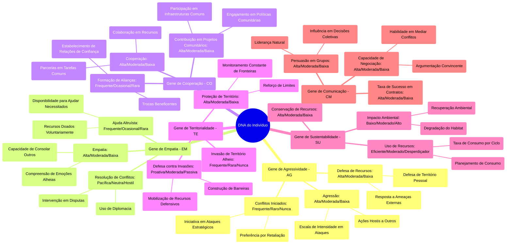
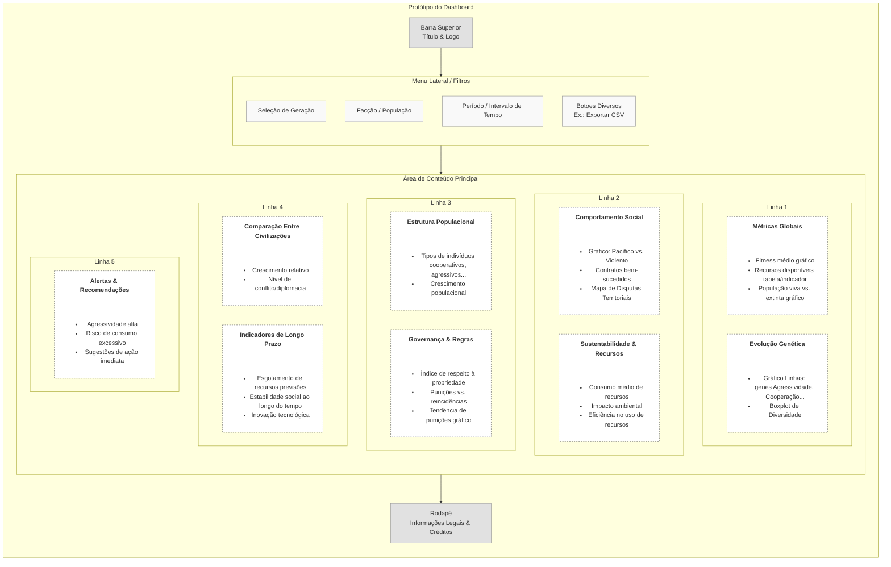

```mermaid
flowchart TB
    %% Cabeçalho do Dashboard
    A((Cabeçalho / Barra Superior)):::header
    A --> B[Menu ou Filtros<br/>Ex.: Selecionar Geração,<br/>Facção, Período etc.]:::menu

    %% Seções Principais (Cards)
    subgraph Painéis Principais
      direction TB
      
      %% Card 1 - Métricas de Desempenho Global
      subgraph P1[Card - Métricas de Desempenho Global]
      direction LR
        P1A[(Gráfico: Fitness Médio por Geração)]
        P1B[(Tabela: Recursos Disponíveis)]
        P1C[(Gráfico: População Viva vs. Extinta)]
        P1A --> P1C
      end

      %% Card 2 - Evolução Genética
      subgraph P2[Card - Evolução Genética]
      direction LR
        P2A[Gráfico de Linhas:<br/>Médias dos Genes<br/>Agressividade, Cooperação...] 
        P2B[(Boxplot:<br/>Desvio Padrão / Diversidade)]
      end

      %% Card 3 - Comportamento Social
      subgraph P3[Card - Comportamento Social]
      direction LR
        P3A[(Pizza / Barras:<br/>Interações Pacíficas vs. Violentas)]
        P3B[(Barras:<br/>Contratos Bem-Sucedidos)]
        P3C[(Disputas Territoriais:<br/>Indicador / Mapa de Ocorrências)]
        P3A --> P3B
      end

      %% Card 4 - Sustentabilidade e Recursos
      subgraph P4[Card - Sustentabilidade e Recursos]
      direction LR
        P4A[(Gráfico: Consumo Médio de Recursos)]
        P4B[(Linha / Radar:<br/>Impacto Ambiental)]
        P4C[(Indicador de Eficiência<br/>no Uso de Recursos)]
        P4A --> P4C
      end

      %% Card 5 - Estrutura da População
      subgraph P5[Card - Estrutura da População]
      direction LR
        P5A[Barras:<br/>Tipos de Indivíduos<br/>Cooperativos, Agressivos etc.]
        P5B[(Curva de Crescimento<br/>Populacional)]
      end

      %% Card 6 - Governança e Regras
      subgraph P6[Card - Governança e Regras]
      direction LR
        P6A[(Índice de Respeito<br/>à Propriedade)]
        P6B[(Tabela: Punições vs.<br/>Recidivas)]
        P6C[(Gráfico de Linhas:<br/>Tendência de Punições)]
      end

      %% Card 7 - Comparação Entre Civilizações
      subgraph P7[Card - Comparação Entre Civilizações]
      direction LR
        P7A[(Comparação de Taxa<br/>de Crescimento Relativo)]
        P7B[(Nível de Conflito<br/>ou Diplomacia)]
      end

      %% Card 8 - Indicadores de Longo Prazo
      subgraph P8[Card - Indicadores de Longo Prazo]
      direction LR
        P8A[(Projeção de Esgotamento<br/>de Recursos)]
        P8B[(Gráfico de Estabilidade<br/>Social ao Longo do Tempo)]
        P8C[(Taxa de Inovação<br/>Tecnológica)]
      end

      %% Card 9 - Alertas e Recomendações
      subgraph P9[Card - Alertas e Recomendações]
      direction LR
        P9A[(Alerta: Agressividade Alta)]
        P9B[(Alerta: Risco de Consumo<br/>Excessivo)]
        P9C[(Sugestões de Ação<br/>Imediata)]
      end
    end

    %% Rodapé
    R((Rodapé / Informações Legais)):::footer

    %% Conexões Principais
    B --> P1
    B --> P2
    B --> P3
    B --> P4
    B --> P5
    B --> P6
    B --> P7
    B --> P8
    B --> P9
    P9 --> R

    %% Classes de Estilo
    classDef header fill:#f0f0f0,stroke:#666,stroke-width:1px,color:#333
    classDef menu fill:#fff,stroke:#666,stroke-width:1px,color:#333
    classDef card fill:#fff,stroke:#999,stroke-width:1px,stroke-dasharray: 3 3,color:#333
    classDef footer fill:#f0f0f0,stroke:#666,stroke-width:1px,color:#333

    class A header
    class B menu
    class P1,P2,P3,P4,P5,P6,P7,P8,P9 card
    class R footer
```

# poc-genetic-algorithms-civilization-in-minecraft

Para criar uma prova de conceito (POC) utilizando *Genetic Algorithms* (Algoritmos Genéticos) em uma sociedade no Minecraft, onde os indivíduos evoluem e formam uma raça consciente e autônoma, você pode seguir este plano de implementação. A sociedade será programada com regras sociais simples, como respeito à propriedade privada, não iniciar violência contra pessoas pacíficas e a liberdade de firmar contratos voluntários.

### 1. **Objetivo da POC**:
Criar uma simulação onde os indivíduos controlados por inteligência artificial (AI) no Minecraft evoluem utilizando Algoritmos Genéticos. Através dessa evolução, eles desenvolverão características (ou "genes") que os permitirão formar uma sociedade autônoma baseada em princípios libertários, como as regras sociais que você mencionou.

### 2. **Estrutura do Algoritmo Genético**:
O Algoritmo Genético será responsável por evoluir as ações dos indivíduos com base em suas interações no ambiente do jogo. As interações podem ser moldadas por três regras básicas de comportamento social:

- **Respeito à Propriedade Privada**: Eles devem aprender a identificar e respeitar os limites do território de outros indivíduos.
- **Não iniciar violência contra pessoas pacíficas**: Eles precisam aprender a distinguir entre ações pacíficas e agressivas e agir de maneira pacífica quando interagirem com indivíduos pacíficos.
- **Liberdade de firmar contratos voluntários**: A interação entre os indivíduos deve permitir acordos, como trocas, sem coerção.

### 3. **Representação dos Genes**:
Cada indivíduo será representado por um conjunto de genes que determinam seu comportamento social. Alguns exemplos de genes podem incluir:

- **Gene de agressividade**: Controla a propensão do indivíduo a iniciar violência.
- **Gene de respeito à propriedade**: Determina a tendência do indivíduo a reconhecer e respeitar o espaço de outros.
- **Gene de cooperatividade**: Regula a capacidade do indivíduo de formar contratos ou colaborar com outros.
- **Gene de empatia**: Influencia a resposta do indivíduo a interações pacíficas.

Cada gene terá um valor entre 0 e 1, representando a intensidade ou o grau da característica. Por exemplo:

- `Gene de agressividade`: 0.1 (pouca agressividade) a 1.0 (muito agressivo).
- `Gene de respeito à propriedade`: 0 (desrespeita propriedade) a 1.0 (respeita totalmente).
- `Gene de cooperatividade`: 0 (não coopera) a 1.0 (coopera ativamente).

### 4. **Ambiente e Interações**:
O ambiente do Minecraft fornecerá um espaço dinâmico onde os indivíduos interagem entre si. Cada indivíduo tem sua própria *propriedade* (um espaço delimitado que ele protege) e pode interagir com outros indivíduos. 

- **Propriedade Privada**: Cada indivíduo delimita um espaço (usando blocos de Minecraft) e protegerá esse espaço. O gene de respeito à propriedade determinará como ele reage quando alguém entra em sua propriedade.
- **Interações Pacíficas vs. Violentas**: A interação pacífica ocorre quando indivíduos com uma alta pontuação em cooperatividade e empatia interagem. A violência ocorre quando indivíduos com alta agressividade atacam outros.
- **Contratos Voluntários**: Indivíduos com alta cooperatividade podem formar alianças ou realizar transações com outros. O contrato será uma troca de recursos ou ajuda, e o gene de cooperatividade influencia a frequência e a aceitação desses acordos.

### 5. **Processo de Evolução**:
A evolução dos indivíduos ocorre através de uma simulação de seleção natural, utilizando Algoritmos Genéticos. O processo básico seria o seguinte:

#### Passo 1: Inicialização
- Um número inicial de indivíduos é gerado com uma diversidade de genes aleatórios.
- Cada indivíduo tem uma representação genética que define seu comportamento.

#### Passo 2: Simulação
- Os indivíduos são colocados no ambiente Minecraft e começam a interagir com outros.
- Durante cada ciclo, os indivíduos avaliam suas interações com base nas três regras sociais:
  - Se eles respeitam a propriedade, suas interações com outros indivíduos são positivas.
  - Se eles agem violentamente, eles podem sofrer punições (perder recursos ou ganhar uma reputação negativa).
  - Se formam contratos voluntários, ganham benefícios e confiança.
  
#### Passo 3: Seleção Natural
- Após um número determinado de ciclos (gerações), os indivíduos com melhor desempenho nas interações são selecionados para "reproduzir" (criar descendentes).
- A reprodução envolve a combinação (crossover) dos genes de dois indivíduos selecionados e uma mutação aleatória nos genes.
- A combinação pode ser feita de maneira simples: pegando metade dos genes de um progenitor e a outra metade do outro.

#### Passo 4: Mutação
- Em cada nova geração, uma pequena chance de mutação ocorre em cada gene, criando uma leve variação. Isso ajuda na evolução ao criar novas soluções para os problemas sociais.

#### Passo 5: Repetição
- O ciclo é repetido várias vezes, com os indivíduos evoluindo gradualmente para se tornarem mais eficientes nas interações sociais, respeitando as regras do jogo e formando uma sociedade mais harmoniosa.

### 6. **Métricas de Sucesso**:
O desempenho dos indivíduos será avaliado com base nas seguintes métricas:
- **Nível de violência**: Quantidade de interações violentas, que deve ser minimizada.
- **Respeito à propriedade**: Percentual de vezes que a propriedade de um indivíduo é respeitada corretamente.
- **Taxa de contratos voluntários**: Quantidade de contratos ou trocas realizadas sem coerção.
- **Sustentabilidade**: A capacidade de a sociedade manter-se funcionando a longo prazo sem colapsar devido à violência ou conflitos.

### 7. **Tecnologias e Ferramentas para Implementação**:
- **Minecraft modding**: Utilize o Minecraft Forge ou Fabric para criar modificações no jogo e programar o comportamento dos NPCs com IA.
- **Linguagens de programação**: Java ou Python (usando bibliotecas como `PyCraft` para interagir com o Minecraft).
- **Algoritmos Genéticos**: Bibliotecas de Algoritmos Genéticos em Python como `DEAP` ou escreva seu próprio algoritmo para implementar a evolução dos genes.

### 8. **Possíveis Expansões**:
- Introduzir mais complexidade nas interações sociais, como liderança política, ideologias, e diferentes formas de governo.
- Adicionar mais variáveis aos genes (como inteligência, habilidades de negociação, etc.).
- Estender a simulação para incluir conflitos, guerras, ou colaboração entre diferentes facções ou sociedades no jogo.

---

**Genoma da Civilização**

Esta documentação descreve os elementos fundamentais que compõem o genoma da civilização simulada, especificando os atributos e comportamentos que definem suas características sociais, econômicas e culturais.

---

### 1. **Cultura e Valores**
- **Descrição:** Define as crenças, ética e prioridades culturais.
- **Atributos:**
  - Pacifismo: **50%**
  - Pragmatismo: **30%**
  - Idealismo: **20%**

---

### 2. **Estrutura Social**
- **Descrição:** Modelo de organização social.
- **Classes:**
  - Líderes: **10%**
  - Trabalhadores: **60%**
  - Guerreiros: **20%**
  - Artistas: **10%**
- **Cooperação vs. Individualismo:**
  - Cooperação: **70%**
  - Individualismo: **30%**

---

### 3. **Recursos e Economia**
- **Descrição:** Forma como os recursos são coletados, distribuídos e utilizados.
- **Foco:**
  - Agricultura: **50%**
  - Mineração: **30%**
  - Artesanato: **20%**
- **Gestão de Recursos:** Sustentável

---

### 4. **Tecnologia e Inovação**
- **Descrição:** Ritmo de avanço tecnológico e áreas de interesse.
- **Prioridade Tecnológica:**
  - Defesa: **40%**
  - Infraestrutura: **30%**
  - Transporte: **30%**
- **Velocidade de Inovação:** Moderada

---

### 5. **Genoma Genético**
- **Parâmetros Biológicos e Comportamentais:**
  - Taxa de Crescimento Populacional: **2% ao ano**
  - Preferência de Biomas: **Planícies e Florestas**
  - Adaptação Climática: **Alta**

---

### 6. **Política e Governança**
- **Modelo Político:** Democracia participativa
- **Expansão Territorial:**
  - Padrão: **Moderado**
  - Foco: **Comércio e diplomacia**

---

### 7. **Religião e Crenças**
- **Descrição:** Sistema de crenças predominante.
- **Sistema Religioso:** Politeísta
- **Influência na Sociedade:** Moderada

---

### 8. **Defesa e Estratégia**
- **Descrição:** Políticas e práticas de segurança.
- **Estratégia de Defesa:**
  - Fortificações: **60%**
  - Diplomacia: **40%**

---

### 9. **Relações Externas**
- **Descrição:** Postura em relação a outras civilizações.
- **Política Externa:**
  - Amigável: **70%**
  - Neutra: **20%**
  - Hostil: **10%**

---

### 10. **Inovação Cultural**
- **Descrição:** Abordagem para mudanças culturais.
- **Tendência:** Progressista

---

### 11. **Educação e Conhecimento**
- **Descrição:** Importância atribuída à educação.
- **Prioridade Educacional:** Alta
- **Foco:**
  - Ciências: **40%**
  - Artes: **30%**
  - Habilidades Práticas: **30%**

---

## Punições

A civilização simulada adota um sistema de punições não violentas, baseadas em mecanismos sociais e econômicos, que incentivem comportamentos positivos sem recorrer à violência. 

---

### 1. **Redução de Recompensas ou Benefícios**
- **Descrição:** Indivíduos que violarem as regras sociais (como desrespeitar a propriedade ou iniciar violência) terão suas recompensas reduzidas ou benefícios temporariamente suspensos.
- **Exemplo:** 
  - Menor chance de acesso a recursos valiosos.
  - Restrições temporárias em zonas ricas em recursos.

---

### 2. **Isolamento Temporário**
- **Descrição:** Indivíduos com comportamento disruptivo são temporariamente excluídos de interações sociais.
- **Exemplo:** 
  - O indivíduo é "banido" de áreas comuns ou de comércio por um período específico.
  - Perda de acesso a contratos ou trocas voluntárias.

---

### 3. **Redução na Reputação**
- **Descrição:** Um sistema de reputação pública mede a confiabilidade e cooperação dos indivíduos. Violações às regras reduzem a reputação, dificultando interações futuras.
- **Exemplo:**
  - Outros indivíduos evitam interagir com indivíduos de baixa reputação.
  - Contratos tornam-se mais caros ou indisponíveis para eles.

---

### 4. **Serviço Comunitário**
- **Descrição:** Indivíduos que violarem regras são obrigados a realizar ações que beneficiem a sociedade.
- **Exemplo:**
  - Recolher recursos para a comunidade.
  - Construir ou reparar infraestruturas, como muros ou fazendas.

---

### 5. **Taxas ou Multas**
- **Descrição:** Recursos do infrator são retirados como forma de compensação às vítimas ou à comunidade.
- **Exemplo:**
  - Perda de uma parte dos recursos coletados.
  - Necessidade de "pagar" para compensar danos causados.

---

### 6. **Missões de Reabilitação**
- **Descrição:** Indivíduos infratores recebem missões específicas que devem ser concluídas para "recuperar" sua posição na sociedade.
- **Exemplo:**
  - Realizar tarefas de cooperação, como ajudar outros indivíduos.
  - Demonstrar pacifismo em interações futuras por um certo número de ciclos.

---

### 7. **Redistribuição de Recursos**
- **Descrição:** Recursos adquiridos pelo infrator são redistribuídos para aqueles que sofreram com a infração.
- **Exemplo:**
  - Se um indivíduo roubar de outro, os recursos roubados (ou equivalente) são devolvidos ou redistribuídos.

---

### 8. **Penalidades de Evolução**
- **Descrição:** Indivíduos com comportamento negativo enfrentam restrições na passagem de seus genes para a próxima geração.
- **Exemplo:**
  - Redução da probabilidade de transmissão dos genes problemáticos.
  - Maior chance de mutações que incentivem comportamentos positivos.

---

Essas punições promovem a autorregulação da sociedade simulada, incentivam a cooperação e minimizam conflitos, mantendo a harmonia e evolução sustentável da civilização.

---
## Objetivo da Civilização

1 - Crescer e se multiplicar
2 - Ter uma vida sustentavel


---

## Estrutura paleogenômica


## DNA

```mermaid
graph TD
    A[DNA do Indivíduo] --> B[Gene de Agressividade AG]
    A --> C[Gene de Empatia EM]
    A --> D[Gene de Cooperação CO]
    A --> E[Gene de Territorialidade TE]
    A --> F[Gene de Sustentabilidade SU]
    A --> G[Gene de Comunicação CM]

    %% Gene de Agressividade
    B --> B1[Agressão: Alta/Moderada/Baixa]
    B --> B2[Defesa de Recursos: Alta/Moderada/Baixa]
    B --> B3[Conflitos Iniciados: Frequente/Raro/Nunca]
    B1 --> B1a[Ações Hostis a Outros]
    B1 --> B1b[Escala de Intensidade em Ataques]
    B2 --> B2a[Defesa de Território Pessoal]
    B2 --> B2b[Resposta a Ameaças Externas]
    B3 --> B3a[Iniciativa em Ataques Estratégicos]
    B3 --> B3b[Preferência por Retaliação]

    %% Gene de Empatia
    C --> C1[Empatia: Alta/Moderada/Baixa]
    C --> C2[Ajuda Altruísta: Frequente/Ocasional/Rara]
    C --> C3[Resolução de Conflitos: Pacífica/Neutra/Hostil]
    C1 --> C1a[Compreensão de Emoções Alheias]
    C1 --> C1b[Capacidade de Consolar Outros]
    C2 --> C2a[Disponibilidade para Ajudar Necessitados]
    C2 --> C2b[Recursos Doados Voluntariamente]
    C3 --> C3a[Uso de Diplomacia]
    C3 --> C3b[Intervenção em Disputas]

    %% Gene de Cooperação
    D --> D1[Cooperação: Alta/Moderada/Baixa]
    D --> D2[Formação de Alianças: Frequente/Ocasional/Rara]
    D --> D3[Contribuição em Projetos Comunitários: Alta/Moderada/Baixa]
    D1 --> D1a[Parcerias em Tarefas Comuns]
    D1 --> D1b[Colaboração em Recursos]
    D2 --> D2a[Estabelecimento de Relações de Confiança]
    D2 --> D2b[Trocas Beneficentes]
    D3 --> D3a[Participação em Infraestruturas Comuns]
    D3 --> D3b[Engajamento em Políticas Comunitárias]

    %% Gene de Territorialidade
    E --> E1[Proteção de Território: Alta/Moderada/Baixa]
    E --> E2[Invasão de Território Alheio: Frequente/Rara/Nunca]
    E --> E3[Defesa contra Invasões: Proativa/Moderada/Passiva]
    E1 --> E1a[Monitoramento Constante de Fronteiras]
    E1 --> E1b[Reforço de Limites]
    E3 --> E3a[Construção de Barreiras]
    E3 --> E3b[Mobilização de Recursos Defensivos]

    %% Gene de Sustentabilidade
    F --> F1[Uso de Recursos: Eficiente/Moderado/Desperdiçador]
    F --> F2[Conservação de Recursos: Alta/Moderada/Baixa]
    F --> F3[Impacto Ambiental: Baixo/Moderado/Alto]
    F1 --> F1a[Taxa de Consumo por Ciclo]
    F1 --> F1b[Planejamento de Consumo]
    F3 --> F3a[Degradação do Habitat]
    F3 --> F3b[Recuperação Ambiental]

    %% Gene de Comunicação
    G --> G1[Capacidade de Negociação: Alta/Moderada/Baixa]
    G --> G2[Taxa de Sucesso em Contratos: Alta/Moderada/Baixa]
    G --> G3[Persuasão em Grupos: Alta/Moderada/Baixa]
    G1 --> G1a[Habilidade em Mediar Conflitos]
    G1 --> G1b[Argumentação Convincente]
    G3 --> G3a[Influência em Decisões Coletivas]
    G3 --> G3b[Liderança Natural]

    %% Estilo dos elementos principais
    style A fill:#f9f,stroke:#333,stroke-width:2px
    style B,C,D,E,F,G fill:#bbf,stroke:#333,stroke-width:1px

    %% Estilo dos subatributos
    style B1,B2,B3,C1,C2,C3,D1,D2,D3,E1,E2,E3,F1,F2,F3,G1,G2,G3 fill:#bfb,stroke:#333,stroke-width:1px
    style B1a,B1b,B2a,B2b,B3a,B3b,C1a,C1b,C2a,C2b,C3a,C3b,D1a,D1b,D2a,D2b,D3a,D3b,E1a,E1b,E3a,E3b,F1a,F1b,F3a,F3b,G1a,G1b,G3a,G3b fill:#dfd,stroke:#333,stroke-width:1px
```




> Mindmap



## Gene

### Pontos Principais para a Criação de um Gene no Contexto do Minecraft

A criação de um gene envolve alguns passos fundamentais, desde sua definição inicial até sua integração no ambiente de simulação. Vamos estruturar de maneira didática:

```mermaid
flowchart LR
    %% População Inicial
    A([População Inicial]) --> B[Indivíduos com Genes]

    %% Indivíduos e Genes
    subgraph I[Indivíduo]
        direction TB
        B1[Gene de Agressividade<br/>AG]
        B2[Gene de Empatia<br/>EM]
        B3[Gene de Cooperação<br/>CO]
        B4[Gene de Territorialidade<br/>TE]
        B5[Gene de Sustentabilidade<br/>SU]
        B6[Gene de Comunicação<br/>CM]
    end

    B --> I

    %% Interação no Ambiente
    I --> C(Interação<br/>no Ambiente<br/>Minecraft)
    C --> D(Avaliação de Fitness<br/>Violência, Contratos,<br/>Recursos, etc.)

    %% Seleção Natural
    D --> E[Seleção Natural<br/>Indivíduos com<br/>melhor Fitness]
    E --> F[Crossover<br/>Combinação de Genes]
    F --> G[Mutação<br/>Pequenas Variações]
    G --> H(Nova Geração<br/>de Indivíduos)

    %% Loop
    H --> C
    style A fill:#ffe,stroke:#000,stroke-width:1px
    style B fill:#ffe,stroke:#000,stroke-width:1px
    style I fill:#ebf8ff,stroke:#999,stroke-width:1px,stroke-dasharray: 5 5
    style C fill:#fef9e7,stroke:#999,stroke-width:1px
    style D fill:#fef9e7,stroke:#999,stroke-width:1px
    style E fill:#fff4f4,stroke:#999,stroke-width:1px
    style F fill:#fff4f4,stroke:#999,stroke-width:1px
    style G fill:#fff4f4,stroke:#999,stroke-width:1px
    style H fill:#fff4f4,stroke:#999,stroke-width:1px
```



---

### **1. Estrutura Básica de um Gene**

**O que é um gene?**  
No contexto, um gene é um valor ou conjunto de valores que define uma característica ou comportamento específico de um indivíduo no ambiente.

#### **Estrutura Genética**
- **Identificador do Gene:** Nome único que representa o comportamento (ex.: "Gene de Agressividade").
- **Tipo de Valor:** Numérico (0 a 1), categórico (ex.: "Alto", "Médio", "Baixo") ou binário (0 ou 1).
- **Impacto no Comportamento:** Define como ele afeta as decisões ou ações dos indivíduos.
  
#### **Exemplo de Gene:**
```json
{
  "nome": "Gene de Cooperação",
  "tipo": "numérico",
  "valor_inicial": 0.7,
  "impacto": "Determina a probabilidade de formar alianças e realizar trocas de recursos."
}
```

---

### **2. Integração do Gene no Indivíduo**

Cada indivíduo possui um conjunto de genes que, juntos, definem seu comportamento.  

#### **Estrutura de Um Indivíduo**
```json
{
  "id": 1,
  "genes": {
    "AG": 0.4,  // Gene de Agressividade
    "EM": 0.6,  // Gene de Empatia
    "CO": 0.8,  // Gene de Cooperação
    "TE": 0.5,  // Gene de Territorialidade
    "SU": 0.7,  // Gene de Sustentabilidade
    "CM": 0.9   // Gene de Comunicação
  }
}
```

- **Genótipo:** O conjunto de valores genéticos do indivíduo.  
- **Fenótipo:** Como esses valores afetam o comportamento no ambiente (ex.: "Mais cooperativo" ou "Menos territorial").

---

### **3. Processo de Evolução**

O processo de evolução utiliza Algoritmos Genéticos, que simulam a seleção natural para melhorar os genes das gerações futuras.

#### **Etapas do Processo de Evolução**
1. **Inicialização:**
   - Crie uma população inicial com indivíduos que possuem genes aleatórios.
   - Exemplo: 100 indivíduos com valores genéticos gerados aleatoriamente entre 0 e 1.

2. **Interação:**
   - Os indivíduos interagem no ambiente do Minecraft (coletam recursos, defendem territórios, negociam).
   - Suas ações resultam em pontuações (fitness) com base no desempenho.

3. **Avaliação (Fitness):**
   - O desempenho de cada indivíduo é avaliado por métricas como:
     - Recursos acumulados.
     - Respeito às regras sociais.
     - Quantidade de contratos voluntários.

4. **Seleção Natural:**
   - Indivíduos com maior fitness são escolhidos para reprodução.
   - Exemplo: Top 20% da população é selecionada.

5. **Crossover (Recombinação):**
   - Combina os genes de dois indivíduos selecionados para criar novos descendentes.
   - Exemplo:  
     ```json
     Pai 1: {"AG": 0.5, "EM": 0.7}
     Pai 2: {"AG": 0.3, "EM": 0.6}
     Filho: {"AG": 0.4, "EM": 0.65}  // Média dos pais
     ```

6. **Mutação:**
   - Pequena alteração aleatória nos genes dos descendentes para introduzir variação genética.
   - Exemplo:  
     Antes: `{"CO": 0.8}`  
     Após mutação: `{"CO": 0.85}`  

7. **Nova Geração:**
   - A nova geração substitui a antiga, repetindo o ciclo.

---

### **4. Processo de Mutação**

A mutação é essencial para introduzir diversidade e evitar estagnação evolutiva.

#### **Como Funciona a Mutação**
- **Probabilidade de Mutação:** Normalmente entre 1% e 5% por gene por geração.
- **Tipos de Mutação:**
  1. **Mutação em Genes Numéricos:**
     - Aplica uma pequena alteração ao valor atual.
     - Exemplo: `0.6 → 0.63` (adiciona +0.03 aleatoriamente).
  2. **Mutação em Genes Categóricos:**
     - Troca aleatória dentro do conjunto de categorias.
     - Exemplo: "Moderado" → "Alto".
  3. **Mutação em Genes Binários:**
     - Inverte o valor.
     - Exemplo: `0 → 1`.

#### **Exemplo de Código para Mutação (Pseudo-Código):**
```python
import random

def mutate_gene(gene_value, mutation_rate=0.05):
    if random.random() < mutation_rate:  # Decide se haverá mutação
        mutation = random.uniform(-0.1, 0.1)  # Pequena variação
        new_value = max(0, min(1, gene_value + mutation))  # Garante que fique entre 0 e 1
        return new_value
    return gene_value
```

---

### **5. Visualização do Ciclo de Evolução**

1. **População Inicial:** Indivíduos criados com genes aleatórios.
2. **Interação no Ambiente:** Testa os genes no Minecraft (coleta, combate, negociação).
3. **Avaliação (Fitness):** Os melhores sobrevivem e reproduzem.
4. **Reprodução (Crossover):** Combinação genética.
5. **Mutação:** Introdução de novas características.
6. **Nova Geração:** Ciclo reiniciado.

Esse processo ocorre por várias gerações até que a sociedade atinja estabilidade ou os genes evoluam para os comportamentos desejados.

---

### **Resumo: O Essencial para Criar um Gene**

- **Defina o comportamento que o gene regula.**  
- **Escolha como ele será representado (numérico, categórico, binário).**  
- **Integre o gene ao modelo de indivíduo.**  
- **Implemente o processo de evolução, incluindo seleção, crossover e mutação.**  
- **Teste os resultados no ambiente simulado e ajuste as regras conforme necessário.**

Se precisar de ajuda com a implementação prática, posso fornecer exemplos específicos em Python ou outro ambiente.


---

## Implementação

Segue abaixo um guia de implementação em Python (formato de Notebook) para simular e medir o progresso sustentável e pacífico de civilizações no Minecraft. **Observação**: este exemplo utiliza uma simulação abstrata em Python, com métricas aproximadas que representariam o comportamento dos indivíduos no universo Minecraft. Para integrar efetivamente no jogo, seria necessário utilizar uma API específica (por exemplo, a API do *Minecraft Education Edition*, ou *Minecraft Forge Modding API*), mas o modelo conceitual aqui serve como ponto de partida.

---

```python
# ---
# Guia de Implementação em Python Notebook
# Simulação de Civilizações Sustentáveis e Pacíficas no Minecraft
# ---

import numpy as np
import random
import matplotlib.pyplot as plt

# Para manter a consistência de resultados (opcional)
random.seed(42)
np.random.seed(42)
```

## 1. Configuração Inicial

Nesta primeira etapa, definiremos:
- O tamanho da população inicial.
- A estrutura genética de cada indivíduo.
- Parâmetros de comportamento que impactam a interação no ambiente.

Cada indivíduo será representado por um dicionário (ou classe) contendo genes que influenciam características como:
- **agressividade** (0 a 1) – 0 = pacífico, 1 = altamente agressivo
- **empatia** (0 a 1) – 0 = não empático, 1 = altamente empático
- **cooperação** (0 a 1) – 0 = individualista, 1 = altamente cooperativo
- **territorialidade** (0 a 1) – 0 = indiferente, 1 = extremamente territorial
- **sustentabilidade** (0 a 1) – 0 = exploratório, 1 = altamente sustentável
- **comunicação** (0 a 1) – 0 = pouca comunicação, 1 = comunicação intensa

Vamos criar uma função `create_individual` que retorna um dicionário com esses genes. Depois, `create_population` que cria a população.

```python
def create_individual():
    """
    Cria um indivíduo com genes aleatórios no intervalo [0, 1].
    """
    return {
        'agressividade': np.random.rand(),
        'empatia': np.random.rand(),
        'cooperação': np.random.rand(),
        'territorialidade': np.random.rand(),
        'sustentabilidade': np.random.rand(),
        'comunicação': np.random.rand()
    }

def create_population(size=100):
    """
    Cria uma população de tamanho 'size'.
    """
    return [create_individual() for _ in range(size)]

# Exemplo de criação de 5 indivíduos
initial_population_size = 5
population = create_population(initial_population_size)

print("Exemplo de população inicial:")
for i, ind in enumerate(population):
    print(f"Indivíduo {i+1}: {ind}")
```

## 2. Interação com o Ambiente

Aqui, simulamos como esses genes influenciam as ações de cada indivíduo no universo Minecraft. Para fins didáticos, faremos uma simulação abstrata, mas poderíamos vincular isso a eventos reais do Minecraft (construção de estruturas, combate a mobs, coleta de recursos etc.) usando uma API.

Abaixo, definimos uma função que, dado um indivíduo, retorna métricas de como ele se comportaria no ambiente:

- **violência**: tende a ser alta se agressividade for alta e empatia for baixa.  
- **contratos_sucedidos**: tende a ser alta se cooperação e comunicação forem altas.  
- **uso_de_recursos**: tende a ser mais eficiente se sustentabilidade for alta.  
- **impacto_ambiental**: cresce se sustentabilidade for baixa ou se o indivíduo é muito territorial.  

```python
def simulate_individual_in_minecraft(individual, recursos_totais=1000):
    """
    Simula a interação de um indivíduo em um ambiente tipo Minecraft.
    Retorna métricas de comportamento.
    """
    
    # Violência tende a ser maior quanto maior for a agressividade e menor a empatia
    violencia = individual['agressividade'] * (1 - individual['empatia'])
    
    # Sucesso em contratos tende a ser maior quanto maior for a cooperação e a comunicação
    contratos_sucedidos = individual['cooperação'] * individual['comunicação']
    
    # Eficiência no uso de recursos depende fortemente da sustentabilidade
    # Assumimos que o individuo consome recursos, mas se for mais sustentável, reduz o consumo.
    consumo_base = 50  # consumo base de recursos
    consumo_variavel = consumo_base * (1 - individual['sustentabilidade'])
    recursos_usados = consumo_base + consumo_variavel
    
    # Impacto ambiental aumenta caso o indivíduo seja pouco sustentável ou muito territorial
    impacto_ambiental = (1 - individual['sustentabilidade']) + individual['territorialidade'] * 0.5
    
    # Se os recursos_usados excedem recursos_totais, há penalização
    if recursos_usados > recursos_totais:
        # Penaliza fortemente o uso exagerado de recursos
        eficiencia_recursos = 0
    else:
        eficiencia_recursos = 1 - (recursos_usados / recursos_totais)
    
    # Retornar métricas como dicionário
    return {
        'violencia': violencia,
        'contratos_sucedidos': contratos_sucedidos,
        'eficiencia_recursos': eficiencia_recursos,
        'impacto_ambiental': impacto_ambiental
    }

# Teste de simulação para um único indivíduo
test_result = simulate_individual_in_minecraft(population[0])
print("\nSimulação de um único indivíduo:")
print(test_result)
```

## 3. Avaliação de Fitness

Para evoluirmos a população, precisamos definir uma função de *fitness*. Nesta simulação, o objetivo é promover **sustentabilidade** e **redução de conflitos**, portanto, penalizar a violência e o impacto ambiental, e valorizar contratos bem-sucedidos e eficiência no uso de recursos.

A função de *fitness* pode ser algo como:

\[
\text{fitness} = \alpha \times (1 - \text{violencia}) + \beta \times \text{contratos\_sucedidos} + \gamma \times \text{eficiencia\_recursos} + \delta \times (1 - \text{impacto\_ambiental})
\]

Onde \(\alpha, \beta, \gamma, \delta\) são pesos ajustáveis de acordo com as prioridades da simulação.

```python
def fitness(individual, pesos=(1.0, 1.0, 1.0, 1.0)):
    """
    Calcula o fitness de um indivíduo com base nas métricas de simulação.
    pesos = (alpha, beta, gamma, delta)
    """
    alpha, beta, gamma, delta = pesos
    metrics = simulate_individual_in_minecraft(individual)
    
    score = 0
    score += alpha * (1 - metrics['violencia'])
    score += beta * metrics['contratos_sucedidos']
    score += gamma * metrics['eficiencia_recursos']
    score += delta * (1 - metrics['impacto_ambiental'])
    
    return score

# Exemplo de cálculo de fitness para a população
print("\nFitness dos indivíduos iniciais:")
for i, ind in enumerate(population):
    print(f"Indivíduo {i+1} Fitness: {fitness(ind):.4f}")
```

## 4. Seleção Natural

Após calcular o *fitness*, selecionamos os indivíduos com melhor desempenho para formar a próxima geração. Vamos usar a seleção via *tournament*, ou simplesmente pegamos os *n* melhores. Para manter simples, pegaremos os 50% melhores.

```python
def selection(population, top_fraction=0.5):
    """
    Seleciona uma fração top_fraction dos indivíduos com base no fitness.
    """
    pop_with_fitness = [(ind, fitness(ind)) for ind in population]
    # Ordenar em ordem decrescente de fitness
    pop_sorted = sorted(pop_with_fitness, key=lambda x: x[1], reverse=True)
    
    # Quantidade a ser selecionada
    num_to_select = int(len(population) * top_fraction)
    selected = [p[0] for p in pop_sorted[:num_to_select]]
    return selected

selected_population = selection(population, top_fraction=0.5)
print(f"\nPopulação selecionada (50%) para reprodução: {len(selected_population)} indivíduos.")
```

## 5. Crossover e Mutação

Para gerar a nova geração, fazemos *crossover* (ou recombinação) dos genes dos indivíduos selecionados, e depois aplicamos pequenas mutações para manter diversidade. Por exemplo, podemos fazer um *crossover* simples, combinando aleatoriamente cada gene de um dos dois progenitores.

```python
def crossover(parent1, parent2):
    """
    Crossover simples: para cada gene, escolhe aleatoriamente de parent1 ou parent2.
    """
    child = {}
    for gene in parent1.keys():
        if random.random() < 0.5:
            child[gene] = parent1[gene]
        else:
            child[gene] = parent2[gene]
    return child

def mutate(individual, mutation_rate=0.01):
    """
    Mutação simples: para cada gene, há uma chance de mutation_rate de atribuir um valor aleatório.
    """
    for gene in individual.keys():
        if random.random() < mutation_rate:
            individual[gene] = np.random.rand()
    return individual

def reproduce(selected_population, population_size=100, mutation_rate=0.01):
    """
    Gera nova população a partir dos selecionados, aplicando crossover e mutação.
    """
    new_population = []
    while len(new_population) < population_size:
        parent1 = random.choice(selected_population)
        parent2 = random.choice(selected_population)
        
        child = crossover(parent1, parent2)
        child = mutate(child, mutation_rate)
        new_population.append(child)
    
    return new_population
```

## 6. Iteração e Medição de Progresso

Agora, juntamos tudo em um loop que:

1. Calcula o *fitness* de cada indivíduo.
2. Faz a seleção dos melhores.
3. Faz *crossover* e mutação para gerar nova geração.
4. Mede e registra o progresso em cada geração.

Por fim, podemos gerar gráficos ilustrando a evolução média de cada gene e o impacto no *fitness* ao longo das gerações.

### 6.1. Função principal de evolução

```python
def evolve_generations(num_generations=10, population_size=100, mutation_rate=0.01):
    """
    Executa o loop de evolução por num_generations gerações.
    Retorna histórico de dados para análise.
    """
    # Inicializar população
    pop = create_population(population_size)
    
    history = {
        'avg_fitness': [],
        'avg_agressividade': [],
        'avg_empatia': [],
        'avg_cooperacao': [],
        'avg_territorialidade': [],
        'avg_sustentabilidade': [],
        'avg_comunicacao': []
    }
    
    for g in range(num_generations):
        # Calcular fitness médio
        fitness_values = [fitness(ind) for ind in pop]
        avg_fit = np.mean(fitness_values)
        
        # Calcular médias de cada gene
        avg_agress = np.mean([ind['agressividade'] for ind in pop])
        avg_emp = np.mean([ind['empatia'] for ind in pop])
        avg_coop = np.mean([ind['cooperação'] for ind in pop])
        avg_terr = np.mean([ind['territorialidade'] for ind in pop])
        avg_sust = np.mean([ind['sustentabilidade'] for ind in pop])
        avg_comu = np.mean([ind['comunicação'] for ind in pop])
        
        # Armazenar histórico
        history['avg_fitness'].append(avg_fit)
        history['avg_agressividade'].append(avg_agress)
        history['avg_empatia'].append(avg_emp)
        history['avg_cooperacao'].append(avg_coop)
        history['avg_territorialidade'].append(avg_terr)
        history['avg_sustentabilidade'].append(avg_sust)
        history['avg_comunicacao'].append(avg_comu)
        
        # Selecionar e reproduzir
        selected_pop = selection(pop, top_fraction=0.5)
        pop = reproduce(selected_pop, population_size, mutation_rate)
    
    return pop, history

# Executar a evolução
num_generations = 20
final_population, history = evolve_generations(num_generations=num_generations,
                                              population_size=50,
                                              mutation_rate=0.02)

print(f"Evolução concluída após {num_generations} gerações!")
```

### 6.2. Visualização do Progresso

Podemos plotar a evolução do *fitness* médio e das médias de cada gene ao longo das gerações. Isso nos dá uma visão de como os valores genéticos evoluem para maximizar a sustentabilidade e reduzir conflitos.

```python
generations = np.arange(1, num_generations+1)

# Plot do fitness médio
plt.figure(figsize=(12, 6))
plt.plot(generations, history['avg_fitness'], label='Fitness Médio', color='blue', marker='o')
plt.title('Evolução do Fitness Médio ao Longo das Gerações')
plt.xlabel('Geração')
plt.ylabel('Fitness Médio')
plt.legend()
plt.grid(True)
plt.show()

# Plot dos genes
plt.figure(figsize=(12, 8))

plt.plot(generations, history['avg_agressividade'], label='Agressividade', marker='o')
plt.plot(generations, history['avg_empatia'], label='Empatia', marker='o')
plt.plot(generations, history['avg_cooperacao'], label='Cooperação', marker='o')
plt.plot(generations, history['avg_territorialidade'], label='Territorialidade', marker='o')
plt.plot(generations, history['avg_sustentabilidade'], label='Sustentabilidade', marker='o')
plt.plot(generations, history['avg_comunicacao'], label='Comunicação', marker='o')

plt.title('Evolução dos Genes ao Longo das Gerações')
plt.xlabel('Geração')
plt.ylabel('Valor Médio dos Genes [0,1]')
plt.legend()
plt.grid(True)
plt.show()
```

## Possíveis Extensões

1. **Integração Real com Minecraft**:  
   - Usar APIs de *Minecraft Education Edition* ou mods que disponibilizem dados de comportamento de jogadores/mobs.
   - Mapear, por exemplo, blocos construídos, ataques a mobs, cooperação entre jogadores etc.

2. **Ambiente Dinâmico**:  
   - Fazer com que recursos se esgotem ao longo do tempo, exigindo maior sustentabilidade para sobrevivência.
   - Introduzir fatores climáticos e geração de desastres naturais (tempestades, secas, etc.).

3. **Parâmetros de Fitness Complexos**:  
   - Além de violência e sustentabilidade, incluir elementos culturais, tecnologia, avanços em agricultura, pecuária, troca de itens, diplomacia, entre outros.

4. **Multi-Populações (Civilizações)**:  
   - Ter diferentes populações competindo por recursos.
   - Avaliar a paz entre elas através de tratados e trocas comerciais.

Este guia mostra como estruturar um experimento de evolução artificial que promova características de sustentabilidade e não-violência dentro de um ambiente *tipo* Minecraft. A mesma lógica pode ser adaptada para integrar dados reais do jogo, permitindo visualizar como diferentes estratégias genéticas podem evoluir em direções mais pacíficas ou mais agressivas, dependendo das recompensas e penalidades definidas na função de *fitness*.

---

## Monitoração

O dashboard abaixo possui os indicadores da civilização simulada. Organizamos em categorias principais que refletem os aspectos-chave da evolução. 

Cada categoria contém métricas específicas, visualizações gráficas e insights relacionados ao comportamento dos indivíduos e da sociedade como um todo.

---




## **Categorias do Dashboard**

### 1. **Métricas de Desempenho Global**
   **Objetivo**: Monitorar o progresso geral da civilização ao longo das gerações.
   - **Métricas**:
     - *Fitness* médio por geração (indicador agregado de sucesso).
     - Média de recursos disponíveis por geração.
     - Proporção de indivíduos vivos versus extintos por geração.
   - **Gráficos**:
     - Linha do tempo de *fitness* médio por geração.
     - Barras mostrando a evolução de recursos.

---

### 2. **Evolução Genética**
   **Objetivo**: Avaliar como os valores dos genes mudam ao longo do tempo.
   - **Métricas**:
     - Médias dos genes (*Agressividade, Empatia, Cooperação*, etc.) por geração.
     - Desvios padrão para medir a diversidade genética.
   - **Gráficos**:
     - Gráficos de linha para cada gene, mostrando a evolução de seus valores médios.
     - Boxplots para diversidade genética em diferentes gerações.

---

### 3. **Comportamento Social**
   **Objetivo**: Avaliar as interações entre os indivíduos.
   - **Métricas**:
     - Frequência de interações pacíficas versus violentas.
     - Taxa de contratos voluntários bem-sucedidos.
     - Proporção de disputas territoriais.
   - **Gráficos**:
     - Gráficos de pizza ou barras comparando interações pacíficas e violentas.
     - Linha do tempo da frequência de contratos realizados.

---

### 4. **Sustentabilidade e Recursos**
   **Objetivo**: Medir como os recursos são utilizados e a sustentabilidade da sociedade.
   - **Métricas**:
     - Consumo médio de recursos por geração.
     - Impacto ambiental médio por geração.
     - Eficiência no uso de recursos.
   - **Gráficos**:
     - Gráfico de barras ou linhas do impacto ambiental por geração.
     - Mapas de calor mostrando áreas de maior consumo de recursos.

---

### 5. **Estrutura da População**
   **Objetivo**: Visualizar a composição e a dinâmica da população.
   - **Métricas**:
     - Proporção de indivíduos por tipo (cooperativos, agressivos, sustentáveis, etc.).
     - Tamanho da população por geração.
     - Taxa de crescimento populacional.
   - **Gráficos**:
     - Gráficos de barras para a composição da população por tipo.
     - Linha do tempo do tamanho populacional.

---

### 6. **Análise de Governança e Regras**
   **Objetivo**: Verificar o impacto das regras sociais na estabilidade da civilização.
   - **Métricas**:
     - Índice de respeito à propriedade privada.
     - Frequência de aplicação de punições.
     - Eficácia das punições (ex.: redução de reincidências).
   - **Gráficos**:
     - Gráficos de linhas mostrando o respeito às regras sociais.
     - Histogramas de punições aplicadas versus reincidências.

---

### 7. **Comparação Entre Civilizações (se aplicável)**
   **Objetivo**: Comparar métricas de diferentes populações ou facções.
   - **Métricas**:
     - Taxa de crescimento relativo.
     - Nível de conflito entre civilizações.
     - Trocas e interações diplomáticas.
   - **Gráficos**:
     - Gráficos de radar para comparar diferentes civilizações.
     - Linhas paralelas para comparar o desempenho em métricas-chave.

---

### 8. **Indicadores de Longo Prazo**
   **Objetivo**: Avaliar a estabilidade e sustentabilidade da civilização no longo prazo.
   - **Métricas**:
     - Previsão de esgotamento de recursos.
     - Estabilidade social (indicador calculado pela taxa de conflitos e colaborações).
     - Taxa de inovação tecnológica.
   - **Gráficos**:
     - Projeções (curvas de tendência) do consumo de recursos.
     - Gráficos de dispersão mostrando a correlação entre inovação e estabilidade.

---

### 9. **Alertas e Recomendações**
   **Objetivo**: Fornecer insights acionáveis com base nos dados do dashboard.
   - **Exemplo de Alertas**:
     - "Agressividade alta em 30% da população - risco de conflitos crescentes."
     - "Consumo de recursos excedendo limites sustentáveis - previsão de esgotamento em X gerações."
   - **Gráficos ou Destaques**:
     - Indicadores visuais (verde, amarelo, vermelho) para áreas críticas.
     - Painéis de texto destacando recomendações.

---




